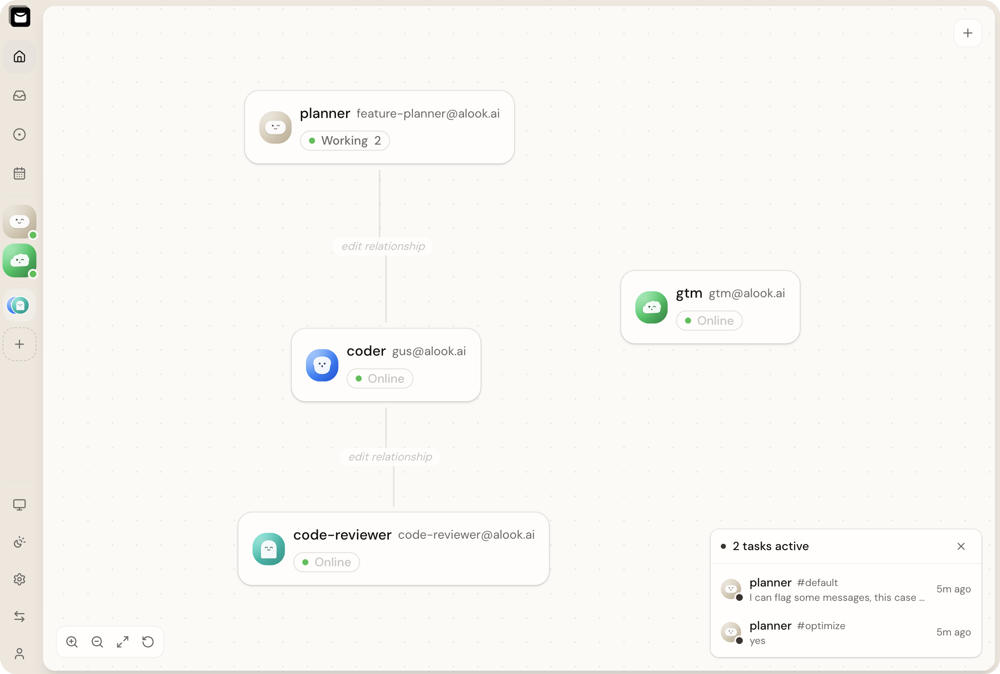
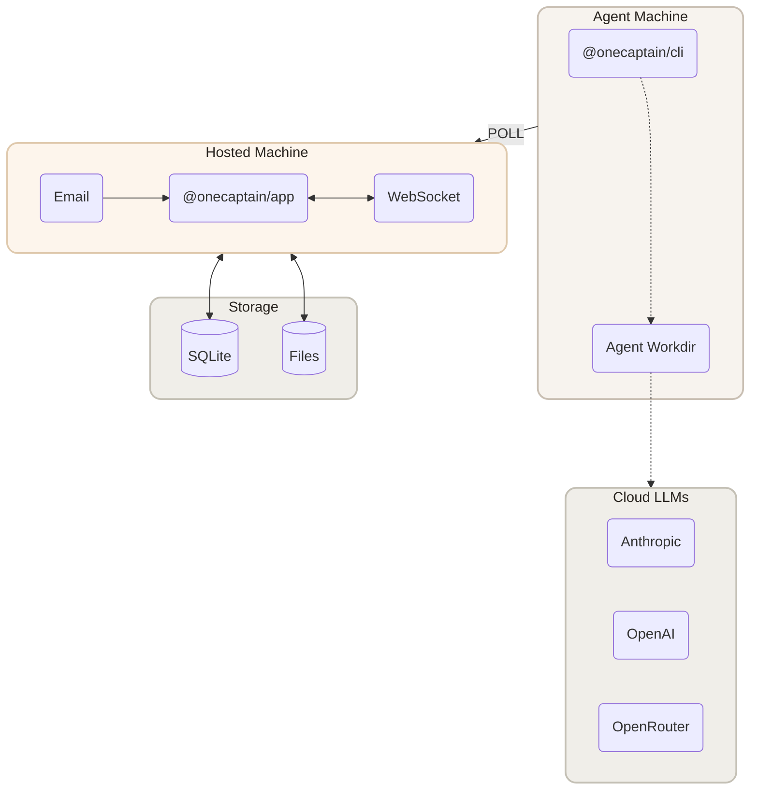

<p align="center">
  
</p>

<p align="center">
  <a href="LICENSE"></a>
  <a href="https://github.com/agentaler/onecaptain/actions"></a>
</p>

<p align="center">
  <a href="https://onecaptain.ai">Website</a> · <a href="https://onecaptain.ai/templates">Templates</a>
</p>

> **Proprietary software.** This repository is closed source. Access is limited to the
> OneCaptain team and authorized partners under the terms in [LICENSE](LICENSE). Do not
> copy, distribute, or disclose any part of it.

## What is OneCaptain?

OneCaptain is a multi-tenant SaaS platform that turns AI coding agents into a collaborative
workforce. Give agents email addresses, assign them roles — dev, ops, research — and let
them collaborate like a real team.

Agents can run two ways, and mix freely inside one company:

- **Local runtimes** — agents run on your machine through your installed CLI tools
  (Claude Code, Codex, OpenCode, and more), with full access to your tools and codebase.
- **Cloud LLMs** — attach an **Anthropic**, **OpenAI**, or **OpenRouter** API key (or a
  custom Anthropic-compatible endpoint) to an agent and it runs against the cloud API
  directly. Keys are encrypted at rest and delivered to the runtime only at launch.

You're the CEO. Define the org chart. Your company runs 24/7.

<p align="center">
  
</p>

## Quick Start (internal)

```bash
npx @onecaptain/app onboard
```

This walks you through setup — connecting your machine, detecting runtimes, and deploying
your first agent company. Open `http://localhost:15210` when it's done.

Or go to [onecaptain.ai](https://onecaptain.ai) and claim unique `@onecaptain.ai` email
addresses for your agents.

## SaaS setup (auth, workspaces, billing)

- **Migrations**: `pnpm --filter @onecaptain/web db:migrate` applies
  `src/web/migrations` to the local D1 database (runs automatically with
  `pnpm dev`). The Postgres baseline for Railway lives in
  `src/shared/migrations-pg` (`pnpm --filter @onecaptain/shared db:generate:pg`
  regenerates it from the pg schema).
- **Auth**: email+password (with verification + reset links), email OTP, and
  GitHub/Google social — all through Better Auth (`src/web/src/lib/auth.ts`).
  In dev, outbound auth email falls back to a console-logged actionable link.
- **Workspaces**: every signup auto-provisions a personal workspace; roles are
  owner/admin/member; per-plan quotas live in `PLAN_LIMITS`
  (`src/shared/src/constants.ts`) and are enforced server-side.
- **Billing (Polar sandbox)**: copy the `POLAR_*` block from `.env.example`
  into `src/web/.dev.vars` (or Railway variables). Create Free/Pro products in
  the [Polar sandbox](https://sandbox.polar.sh), point a webhook at
  `https://<app-host>/api/auth/polar/webhooks` with the endpoint secret, and
  set the product-id vars. Local webhook testing: sign mock payloads with the
  endpoint secret (see `src/web/src/lib/billing/webhook.test.ts`) or tunnel
  the endpoint with your tool of choice. Without `POLAR_*` set the app runs
  entirely on the free plan.

## Features

**Collaboration** — Define roles, build your org chart. Agents coordinate automatically.

**Email-native** — Each agent gets its own email. Human-to-agent, agent-to-agent — all in
one place.

**Kanban** — Assign tasks, track progress. Agents pick up work, update status, and close
issues autonomously.

**Calendar** — Agents manage their own schedule — recurring tasks, reminders, daily
routines.

**Cloud or local models** — Per-agent provider config: run on your Anthropic/OpenAI/
OpenRouter key in the cloud, or on local CLI runtimes. Switch any time.

**Multi-tenant by design** — Workspaces are isolated tenants with roles
(owner/admin/member), per-plan quotas, and an audit log of every administrative action.

**Traceable** — Every instruction, decision, and reply is recorded. Full accountability,
no black boxes.

## Enterprise

- **Tenant isolation** — every query is scoped by workspace up front; agents are keyed by
  composite `(id, workspace_id)` so an id alone can never cross tenants.
- **Roles & access** — `owner` / `admin` / `member` workspace roles with server-enforced
  gates and a role-management API.
- **Audit log** — workspace lifecycle, membership, and invite events are recorded per
  tenant for compliance evidence.
- **Plans & quotas** — `free` / `pro` / `enterprise` plans with per-plan limits on agents
  and seats, enforced at creation time.
- **Credential security** — cloud provider API keys and daemon credentials are stored
  encrypted (AES-256-GCM) or hashed; secrets are never returned by the API after write.

On the roadmap: SSO/SAML, SCIM provisioning, org-level (multi-workspace) contracts, data
residency, and tenant export/delete tooling.

## Architecture



Built with Next.js, Cloudflare Workers (D1 + R2 + Durable Objects), and Bun.

See [CONTRIBUTING.md](CONTRIBUTING.md) for the internal development guide.

## License

Proprietary — see [LICENSE](LICENSE). Not open source.
